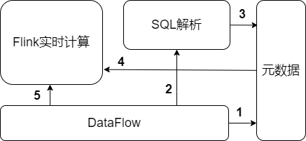

# 简介
一个基于flink的实时计算平台

## 开发版本

```shell
flink: 1.12（当前最新版本）
kafka: 2.5.0
```

## 输入和输出

基于编辑的`dataflow.json`文件，生成flink计算任务

配置文件：
```json
{
  "name": "实时计算xxx",
  "input_table_list": [
    "zc_stream7"
  ],
  "output_table": "zc_stream8",
  "process_config": {
    "window_type": "tumble",
    "window_size": 10,
    "slide_size": null,
    "session_gap": null,
    "sql": "select count(*) as my_count from zc_stream7"
  }
}
```

配置解释：
- 输入：input_table_list，列表，单表查询或join查询
- 输出：output_table，全局唯一
- 计算配置：process_config，包含sql语句和窗口配置

## 已实现功能

| 输入/窗口 | 无窗口 | 滚动窗口 | 滑动窗口 | 会话窗口 |
|  :--:  | :--:  |  :--:  |  :--:  |  :--:  |
|       单表查询       | √ | √ | √ | √ |
| 流[inner join]流 | - | √ | - | - |
| 流[left join]流 | - | √ | - | - |
| 流[right join]流 | - | √ | - | - |
| 流[inner join]静态表 | √ | - | - | - |
| 流[left join]静态表 | √ | - | - | - |
| 流[right join]静态表 | - | - | - | - |

说明：

- 只支持两个流的join，不支持三个以上的流的join
- 流与流的join只支持滚动窗口，其它窗口的join非技术问题，只是需求意义不大
- 流与静态的表join只支持inner join和left join，right join 意义不大

## 架构

整个实现分为四个模块：

- DataFlow，抽象成`dataflow.json`配置文件。实际可做成前端，让用户配置
- SQL解析，主要将用户配置的sql文件和窗口做一定的加工处理
- 元数据，保存表的scheme信息和存储信息
- Flink实时计算，解析客户端，提交flink任务

模块调用图：



1~3：用户配置文件，存储信息直接保存元数据，sql信息经过解析后存入元数据

5：用户启动、停止任务

4：flink拉取元数据信息，构造执行图，执行任务

程序的输入和输出均为`kafka`，至于由`kafka`搬运到其它存储组件，不是计算考虑的内容

# 运行

## 数据源

- web访问记录表（流表）

- 表名：zc_source_wb

- 存储：kafka

```shell
➜  ~ kafka-console-consumer.sh --bootstrap-server localhost:9092 --topic zc_source_wb --from-beginning
{"event_time":"2021-01-01 00:00:12","ip":"127.0.0.8","method":"HEAD","name":"zhangsan","size":650,"status":"BEGIN"}
{"event_time":"2021-01-01 00:00:15","ip":"127.0.0.1","method":"POST","name":"lijianting","size":461,"status":"END"}
{"event_time":"2021-01-01 00:00:18","ip":"127.0.0.7","method":"GET","name":"maliu","size":960,"status":"ERROR"}
{"event_time":"2021-01-01 00:00:18","ip":"127.0.0.2","method":"GET","name":"zhangsan","size":306,"status":"WAIT"}
{"event_time":"2021-01-01 00:00:20","ip":"127.0.0.7","method":"PUT","name":"zhuxudong","size":744,"status":"OK"}
{"event_time":"2021-01-01 00:00:20","ip":"127.0.0.1","method":"PATCH","name":"lijianting","size":965,"status":"FAIL"}
{"event_time":"2021-01-01 00:00:23","ip":"127.0.0.8","method":"POST","name":"xiaoqiang","size":524,"status":"WAIT"}
{"event_time":"2021-01-01 00:00:26","ip":"127.0.0.2","method":"POST","name":"lisi","size":175,"status":"OK"}
{"event_time":"2021-01-01 00:00:26","ip":"127.0.0.7","method":"GET","name":"zhuao","size":264,"status":"BEGIN"}
{"event_time":"2021-01-01 00:00:26","ip":"127.0.0.6","method":"DELETE","name":"xiaoqiang","size":623,"status":"WAIT"}
{"event_time":"2021-01-01 00:00:30","ip":"127.0.0.6","method":"PUT","name":"xiaoqiang","size":483,"status":"BEGIN"}
{"event_time":"2021-01-01 00:00:31","ip":"127.0.0.7","method":"GET","name":"hushuyuan","size":300,"status":"OK"}
{"event_time":"2021-01-01 00:00:35","ip":"127.0.0.6","method":"DELETE","name":"xiaoqiang","size":244,"status":"FAIL"}
{"event_time":"2021-01-01 00:00:38","ip":"127.0.0.4","method":"HEAD","name":"jiangchanghong","size":299,"status":"ERROR"}
{"event_time":"2021-01-01 00:00:41","ip":"127.0.0.4","method":"DELETE","name":"lijianting","size":876,"status":"OK"}
{"event_time":"2021-01-01 00:00:45","ip":"127.0.0.1","method":"HEAD","name":"maliu","size":953,"status":"BEGIN"}
{"event_time":"2021-01-01 00:00:47","ip":"127.0.0.6","method":"GET","name":"jiangchanghong","size":477,"status":"END"}
{"event_time":"2021-01-01 00:00:47","ip":"127.0.0.1","method":"PUT","name":"xiaoqiang","size":165,"status":"ERROR"}
{"event_time":"2021-01-01 00:00:49","ip":"127.0.0.7","method":"GET","name":"hushuyuan","size":779,"status":"END"}
{"event_time":"2021-01-01 00:00:51","ip":"127.0.0.6","method":"GET","name":"piyuhang","size":480,"status":"WAIT"}
```

- IP表（流表）

- 表名：zc_source_ip

- 存储：kafka

```shell
➜  ~ kafka-console-consumer.sh --bootstrap-server localhost:9092 --topic zc_source_ip --from-beginning
{"city":"钟祥","event_time":"2021-01-01 00:00:13","ip":"127.0.0.5"}
{"city":"钟祥","event_time":"2021-01-01 00:00:13","ip":"127.0.0.1"}
{"city":"长沙","event_time":"2021-01-01 00:00:17","ip":"127.0.0.7"}
{"city":"长沙","event_time":"2021-01-01 00:00:20","ip":"127.0.0.7"}
{"city":"深圳","event_time":"2021-01-01 00:00:23","ip":"127.0.0.1"}
{"city":"广州","event_time":"2021-01-01 00:00:27","ip":"127.0.0.4"}
{"city":"广州","event_time":"2021-01-01 00:00:31","ip":"127.0.0.6"}
{"city":"未知","event_time":"2021-01-01 00:00:31","ip":"127.0.0.8"}
{"city":"荆门","event_time":"2021-01-01 00:00:34","ip":"127.0.0.1"}
{"city":"荆门","event_time":"2021-01-01 00:00:37","ip":"127.0.0.4"}
{"city":"本地","event_time":"2021-01-01 00:00:39","ip":"127.0.0.8"}
{"city":"荆门","event_time":"2021-01-01 00:00:43","ip":"127.0.0.3"}
{"city":"荆门","event_time":"2021-01-01 00:00:44","ip":"127.0.0.2"}
{"city":"未知","event_time":"2021-01-01 00:00:48","ip":"127.0.0.6"}
{"city":"未知","event_time":"2021-01-01 00:00:48","ip":"127.0.0.6"}
{"city":"广州","event_time":"2021-01-01 00:00:52","ip":"127.0.0.5"}
{"city":"广州","event_time":"2021-01-01 00:00:56","ip":"127.0.0.3"}
{"city":"钟祥","event_time":"2021-01-01 00:00:58","ip":"127.0.0.7"}
{"city":"京山","event_time":"2021-01-01 00:01:00","ip":"127.0.0.6"}
{"city":"荆门","event_time":"2021-01-01 00:01:02","ip":"127.0.0.1"}
```

- 静态IP表（静态表）

- 表名：zc_table_ip

- 存储：MySQL

```shell
id	ip	city
1	127.0.0.1	本地
2	127.0.0.2	长沙
3	127.0.0.3	广州
4	127.0.0.4	深圳
5	127.0.0.5	钟祥
6	127.0.0.6	荆门
7	127.0.0.7	京山
8	127.0.0.9	未知
```

## 提交运行


## 测试

当然，不止测试了两个任务，这里只挑两个典型的进行说明

### 01

配置文件：dataflow01.json

示意图：


实时计算1输出：

```shell
➜  ~ kafka-console-consumer.sh --bootstrap-server localhost:9092 --topic zc_stream1 --from-beginning
{"method":"HEAD","size":650,"window_end":"2021-01-01 00:00:12","ip":"127.0.0.8","window_start":"2021-01-01 00:00:12","event_time":"2021-01-01 00:00:12"}
{"method":"POST","size":461,"window_end":"2021-01-01 00:00:15","ip":"127.0.0.1","window_start":"2021-01-01 00:00:15","event_time":"2021-01-01 00:00:15"}
{"method":"GET","size":960,"window_end":"2021-01-01 00:00:18","ip":"127.0.0.7","window_start":"2021-01-01 00:00:18","event_time":"2021-01-01 00:00:18"}
{"method":"GET","size":306,"window_end":"2021-01-01 00:00:18","ip":"127.0.0.2","window_start":"2021-01-01 00:00:18","event_time":"2021-01-01 00:00:18"}
{"method":"PUT","size":744,"window_end":"2021-01-01 00:00:20","ip":"127.0.0.7","window_start":"2021-01-01 00:00:20","event_time":"2021-01-01 00:00:20"}
{"method":"PATCH","size":965,"window_end":"2021-01-01 00:00:20","ip":"127.0.0.1","window_start":"2021-01-01 00:00:20","event_time":"2021-01-01 00:00:20"}
{"method":"POST","size":524,"window_end":"2021-01-01 00:00:23","ip":"127.0.0.8","window_start":"2021-01-01 00:00:23","event_time":"2021-01-01 00:00:23"}
{"method":"DELETE","size":623,"window_end":"2021-01-01 00:00:26","ip":"127.0.0.6","window_start":"2021-01-01 00:00:26","event_time":"2021-01-01 00:00:26"}
{"method":"PUT","size":483,"window_end":"2021-01-01 00:00:30","ip":"127.0.0.6","window_start":"2021-01-01 00:00:30","event_time":"2021-01-01 00:00:30"}
{"method":"DELETE","size":876,"window_end":"2021-01-01 00:00:41","ip":"127.0.0.4","window_start":"2021-01-01 00:00:41","event_time":"2021-01-01 00:00:41"}
{"method":"HEAD","size":953,"window_end":"2021-01-01 00:00:45","ip":"127.0.0.1","window_start":"2021-01-01 00:00:45","event_time":"2021-01-01 00:00:45"}
{"method":"GET","size":477,"window_end":"2021-01-01 00:00:47","ip":"127.0.0.6","window_start":"2021-01-01 00:00:47","event_time":"2021-01-01 00:00:47"}
{"method":"GET","size":779,"window_end":"2021-01-01 00:00:49","ip":"127.0.0.7","window_start":"2021-01-01 00:00:49","event_time":"2021-01-01 00:00:49"}
{"method":"GET","size":480,"window_end":"2021-01-01 00:00:51","ip":"127.0.0.6","window_start":"2021-01-01 00:00:51","event_time":"2021-01-01 00:00:51"}
```

实时计算2输出：

```shell
➜  ~ kafka-console-consumer.sh --bootstrap-server localhost:9092 --topic zc_stream2 --from-beginning
{"method":"GET","window_end":"2021-01-01 00:00:25","window_start":"2021-01-01 00:00:15","event_time":"2021-01-01 00:00:25","max_size":960}
{"method":"POST","window_end":"2021-01-01 00:00:25","window_start":"2021-01-01 00:00:15","event_time":"2021-01-01 00:00:25","max_size":524}
{"method":"PUT","window_end":"2021-01-01 00:00:25","window_start":"2021-01-01 00:00:15","event_time":"2021-01-01 00:00:25","max_size":744}
{"method":"PUT","window_end":"2021-01-01 00:00:40","window_start":"2021-01-01 00:00:30","event_time":"2021-01-01 00:00:40","max_size":483}
{"method":"PATCH","window_end":"2021-01-01 00:00:25","window_start":"2021-01-01 00:00:15","event_time":"2021-01-01 00:00:25","max_size":965}
```

实时计算3输出：

```shell
➜  ~ kafka-console-consumer.sh --bootstrap-server localhost:9092 --topic zc_stream3 --from-beginning
{"method":"GET","sum_size":1266,"window_end":"2021-01-01 00:00:20","window_start":"2021-01-01 00:00:10","event_time":"2021-01-01 00:00:20"}
{"method":"HEAD","sum_size":650,"window_end":"2021-01-01 00:00:20","window_start":"2021-01-01 00:00:10","event_time":"2021-01-01 00:00:20"}
{"method":"DELETE","sum_size":623,"window_end":"2021-01-01 00:00:30","window_start":"2021-01-01 00:00:20","event_time":"2021-01-01 00:00:30"}
{"method":"PATCH","sum_size":965,"window_end":"2021-01-01 00:00:30","window_start":"2021-01-01 00:00:20","event_time":"2021-01-01 00:00:30"}
{"method":"POST","sum_size":461,"window_end":"2021-01-01 00:00:20","window_start":"2021-01-01 00:00:10","event_time":"2021-01-01 00:00:20"}
{"method":"PUT","sum_size":744,"window_end":"2021-01-01 00:00:30","window_start":"2021-01-01 00:00:20","event_time":"2021-01-01 00:00:30"}
{"method":"POST","sum_size":524,"window_end":"2021-01-01 00:00:30","window_start":"2021-01-01 00:00:20","event_time":"2021-01-01 00:00:30"}
{"method":"PUT","sum_size":483,"window_end":"2021-01-01 00:00:40","window_start":"2021-01-01 00:00:30","event_time":"2021-01-01 00:00:40"}
```

### 02

配置文件：dataflow02.json

示意图：


实时计算4输出：

```shell
➜  ~ kafka-console-consumer.sh --bootstrap-server localhost:9092 --topic zc_stream_join4 --from-beginning
{"size":461,"window_end":"2021-01-01 00:00:20","city":"钟祥","ip":"127.0.0.1","name":"lijianting","window_start":"2021-01-01 00:00:10","event_time":"2021-01-01 00:00:20"}
{"size":965,"window_end":"2021-01-01 00:00:30","city":"深圳","ip":"127.0.0.1","name":"lijianting","window_start":"2021-01-01 00:00:20","event_time":"2021-01-01 00:00:30"}
{"size":483,"window_end":"2021-01-01 00:00:40","city":"广州","ip":"127.0.0.6","name":"xiaoqiang","window_start":"2021-01-01 00:00:30","event_time":"2021-01-01 00:00:40"}
{"size":960,"window_end":"2021-01-01 00:00:20","city":"长沙","ip":"127.0.0.7","name":"maliu","window_start":"2021-01-01 00:00:10","event_time":"2021-01-01 00:00:20"}
{"size":299,"window_end":"2021-01-01 00:00:40","city":"荆门","ip":"127.0.0.4","name":"jiangchanghong","window_start":"2021-01-01 00:00:30","event_time":"2021-01-01 00:00:40"}
{"size":244,"window_end":"2021-01-01 00:00:40","city":"广州","ip":"127.0.0.6","name":"xiaoqiang","window_start":"2021-01-01 00:00:30","event_time":"2021-01-01 00:00:40"}
{"size":744,"window_end":"2021-01-01 00:00:30","city":"长沙","ip":"127.0.0.7","name":"zhuxudong","window_start":"2021-01-01 00:00:20","event_time":"2021-01-01 00:00:30"}
{"size":264,"window_end":"2021-01-01 00:00:30","city":"长沙","ip":"127.0.0.7","name":"zhuao","window_start":"2021-01-01 00:00:20","event_time":"2021-01-01 00:00:30"}
{"size":477,"window_end":"2021-01-01 00:00:50","city":"未知","ip":"127.0.0.6","name":"jiangchanghong","window_start":"2021-01-01 00:00:40","event_time":"2021-01-01 00:00:50"}
{"size":477,"window_end":"2021-01-01 00:00:50","city":"未知","ip":"127.0.0.6","name":"jiangchanghong","window_start":"2021-01-01 00:00:40","event_time":"2021-01-01 00:00:50"}
```

实时计算5输出：

```shell
➜  ~ kafka-console-consumer.sh --bootstrap-server localhost:9092 --topic zc_stream_join5 --from-beginning
{"size":650,"window_end":"2021-01-01 00:00:12","city":"NULL","ip":"127.0.0.8","name":"zhangsan","window_start":"2021-01-01 00:00:12","event_time":"2021-01-01 00:00:12"}
{"size":461,"window_end":"2021-01-01 00:00:15","city":"本地","ip":"127.0.0.1","name":"lijianting","window_start":"2021-01-01 00:00:15","event_time":"2021-01-01 00:00:15"}
{"size":960,"window_end":"2021-01-01 00:00:18","city":"京山","ip":"127.0.0.7","name":"maliu","window_start":"2021-01-01 00:00:18","event_time":"2021-01-01 00:00:18"}
{"size":306,"window_end":"2021-01-01 00:00:18","city":"长沙","ip":"127.0.0.2","name":"zhangsan","window_start":"2021-01-01 00:00:18","event_time":"2021-01-01 00:00:18"}
{"size":744,"window_end":"2021-01-01 00:00:20","city":"京山","ip":"127.0.0.7","name":"zhuxudong","window_start":"2021-01-01 00:00:20","event_time":"2021-01-01 00:00:20"}
{"size":965,"window_end":"2021-01-01 00:00:20","city":"本地","ip":"127.0.0.1","name":"lijianting","window_start":"2021-01-01 00:00:20","event_time":"2021-01-01 00:00:20"}
{"size":524,"window_end":"2021-01-01 00:00:23","city":"NULL","ip":"127.0.0.8","name":"xiaoqiang","window_start":"2021-01-01 00:00:23","event_time":"2021-01-01 00:00:23"}
{"size":175,"window_end":"2021-01-01 00:00:26","city":"长沙","ip":"127.0.0.2","name":"lisi","window_start":"2021-01-01 00:00:26","event_time":"2021-01-01 00:00:26"}
{"size":264,"window_end":"2021-01-01 00:00:26","city":"京山","ip":"127.0.0.7","name":"zhuao","window_start":"2021-01-01 00:00:26","event_time":"2021-01-01 00:00:26"}
{"size":623,"window_end":"2021-01-01 00:00:26","city":"荆门","ip":"127.0.0.6","name":"xiaoqiang","window_start":"2021-01-01 00:00:26","event_time":"2021-01-01 00:00:26"}
{"size":483,"window_end":"2021-01-01 00:00:30","city":"荆门","ip":"127.0.0.6","name":"xiaoqiang","window_start":"2021-01-01 00:00:30","event_time":"2021-01-01 00:00:30"}
{"size":300,"window_end":"2021-01-01 00:00:31","city":"京山","ip":"127.0.0.7","name":"hushuyuan","window_start":"2021-01-01 00:00:31","event_time":"2021-01-01 00:00:31"}
{"size":244,"window_end":"2021-01-01 00:00:35","city":"荆门","ip":"127.0.0.6","name":"xiaoqiang","window_start":"2021-01-01 00:00:35","event_time":"2021-01-01 00:00:35"}
{"size":299,"window_end":"2021-01-01 00:00:38","city":"深圳","ip":"127.0.0.4","name":"jiangchanghong","window_start":"2021-01-01 00:00:38","event_time":"2021-01-01 00:00:38"}
{"size":876,"window_end":"2021-01-01 00:00:41","city":"深圳","ip":"127.0.0.4","name":"lijianting","window_start":"2021-01-01 00:00:41","event_time":"2021-01-01 00:00:41"}
{"size":953,"window_end":"2021-01-01 00:00:45","city":"本地","ip":"127.0.0.1","name":"maliu","window_start":"2021-01-01 00:00:45","event_time":"2021-01-01 00:00:45"}
{"size":477,"window_end":"2021-01-01 00:00:47","city":"荆门","ip":"127.0.0.6","name":"jiangchanghong","window_start":"2021-01-01 00:00:47","event_time":"2021-01-01 00:00:47"}
{"size":165,"window_end":"2021-01-01 00:00:47","city":"本地","ip":"127.0.0.1","name":"xiaoqiang","window_start":"2021-01-01 00:00:47","event_time":"2021-01-01 00:00:47"}
{"size":779,"window_end":"2021-01-01 00:00:49","city":"京山","ip":"127.0.0.7","name":"hushuyuan","window_start":"2021-01-01 00:00:49","event_time":"2021-01-01 00:00:49"}
{"size":480,"window_end":"2021-01-01 00:00:51","city":"荆门","ip":"127.0.0.6","name":"piyuhang","window_start":"2021-01-01 00:00:51","event_time":"2021-01-01 00:00:51"}
```

实时计算6输出：

```shell
➜  ~ kafka-console-consumer.sh --bootstrap-server localhost:9092 --topic zc_stream_join6 --from-beginning
{"window_end":"2021-01-01 00:00:30","city":"钟祥","window_start":"2021-01-01 00:00:20","event_time":"2021-01-01 00:00:30","max_size":461}
{"window_end":"2021-01-01 00:00:30","city":"长沙","window_start":"2021-01-01 00:00:20","event_time":"2021-01-01 00:00:30","max_size":960}
{"window_end":"2021-01-01 00:00:40","city":"深圳","window_start":"2021-01-01 00:00:30","event_time":"2021-01-01 00:00:40","max_size":965}
{"window_end":"2021-01-01 00:00:40","city":"长沙","window_start":"2021-01-01 00:00:30","event_time":"2021-01-01 00:00:40","max_size":744}
```
